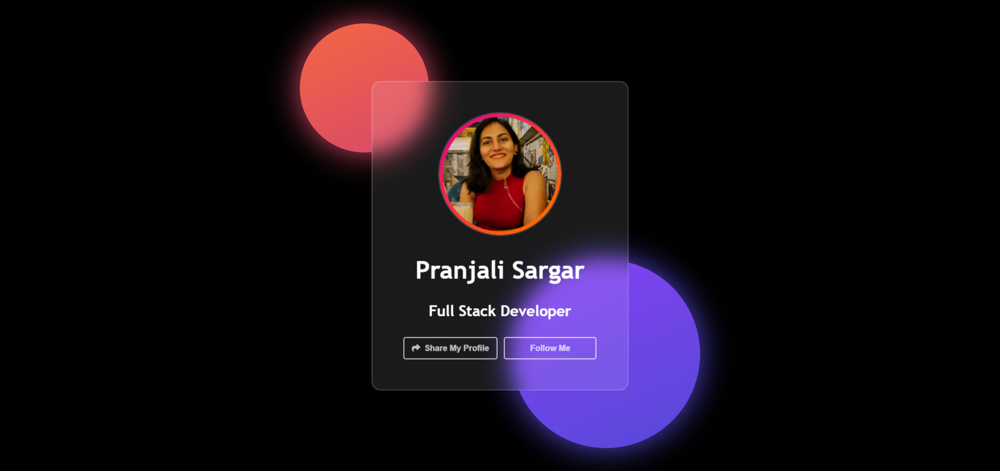
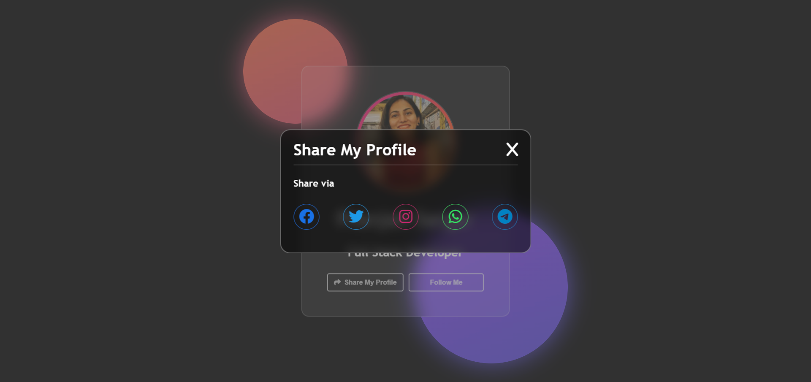

# Share-Modal-App using JS

## Demo link
[Click Here](https://psargar616.github.io/Share-Modal-App/)

## New learnings
- Adding animations to circles to profile picture
- Adding 'onclick' to buttons
- Adding responsiveness to webpage
- After clicking on share button displaying sharing options to 5 different platforms
